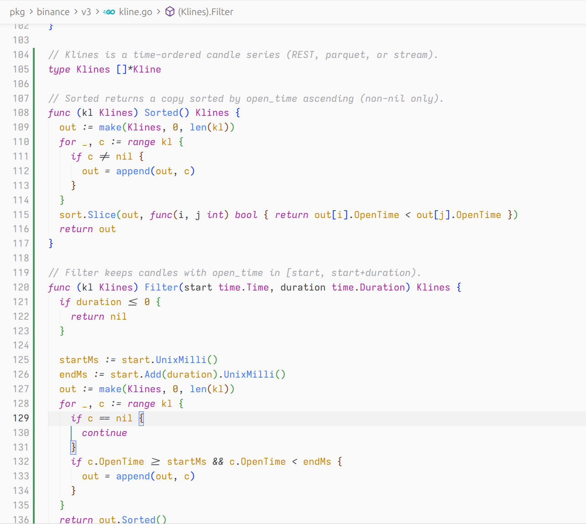

# Atom One Light (eSlider)

Light theme for [Visual Studio Code](https://code.visualstudio.com/) and [Cursor](https://cursor.com/), based on **Atom One Light** with eSlider UI accents. Tuned from the IntelliJ scheme *Atom One Light (Material)* (`source/`).

## Preview

Go code in Cursor — `pkg/binance/v3/kline.go` with ligatures enabled:



- **Keywords** — magenta (`func`, `return`, `for`, `if`)
- **Types** — purple (`Klines`, `Kline`, `time.Time`)
- **Functions / methods** — blue (`make`, `append`, `sort.Slice`, `Sorted`, `Filter`)
- **Variables & fields** — gold (`out`, `c`, `startMs`, `duration`)
- **Comments** — gray-green italic
- **Editor** — `#FAFAFA` background, `#5D70E7` accent

## Install

### Marketplace (recommended)

1. Open **Extensions** (`Ctrl+Shift+X` / `Cmd+Shift+X`)
2. Search for **Atom One Light (eSlider)**
3. Install → **Preferences: Color Theme** → **Atom One Light (eSlider)**

```bash
code --install-extension eSlider.atom-one-light-eslider
cursor --install-extension eSlider.atom-one-light-eslider
```

### VSIX (manual)

Download the latest `.vsix` from [GitHub Releases](https://github.com/eSlider/atom-one-light-eslider/releases):

```bash
cursor --install-extension atom-one-light-eslider-1.0.2.vsix
```

## Activate

```json
"workbench.colorTheme": "Atom One Light (eSlider)"
```

## Palette

| Element | Color |
|--------|--------|
| Background | `#FAFAFA` |
| Foreground | `#383A42` |
| Keywords | `#A626A4` (italic) |
| Types / structs | `#A626A4` |
| Functions | `#4078F2` |
| Variables / consts / fields | `#C18401` |
| Strings | `#50A14F` |
| Accent (tabs, focus) | `#5D70E7` |

## Optional Go settings

Not part of the theme; add to `settings.json` if you want import paths without underlines:

```json
"gopls": {
  "ui.navigation.importShortcut": "Definition"
},
"[go]": {
  "editor.links": false
}
```

## Development

```bash
npx @vscode/vsce package --no-dependencies
```

Releases are built by GitHub Actions (VSIX + VS Marketplace).

## License

MIT — syntax palette derived from [akamud/vscode-theme-onelight](https://github.com/akamud/vscode-theme-onelight) and Atom One Light.
